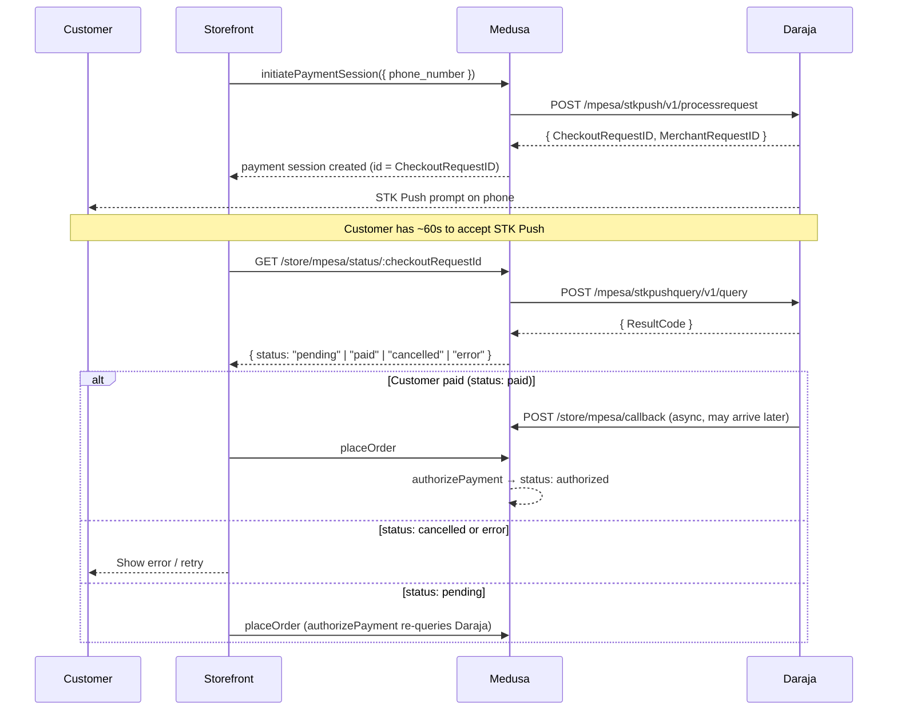
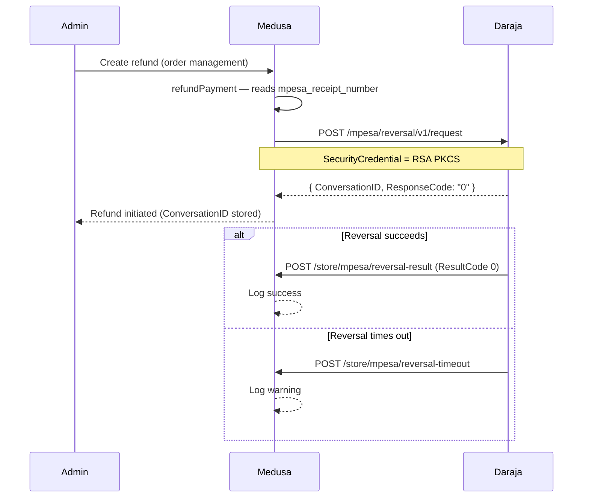

# Medusa M-Pesa Payment Provider

[](https://www.npmjs.com/package/medusa-payment-mpesa)
[](https://opensource.org/licenses/MIT)
[](https://medusajs.com)

A [Medusa v2 Payment Provider](https://docs.medusajs.com/resources/commerce-modules/payment) plugin for [M-Pesa Daraja API](https://developer.safaricom.co.ke/apis) (Safaricom Kenya).

**Features:**

- **STK Push** (Lipa Na M-Pesa Online) — customer receives a payment prompt on their phone
- **Asynchronous confirmation** via Daraja callback webhook + storefront status polling
- **Refunds** via M-Pesa reversal (requires initiator credentials)
- **Sandbox and production** environments
- Phone number normalization — accepts `07XX`, `+254XX`, `254XX`, and bare `7XXXXXXXX` formats
- RSA PKCS#1 v1.5 credential encryption for production reversals (required by Safaricom Daraja API)
- TypeScript-first with exported option types

---

## Table of Contents

- [Requirements](#requirements)
- [Installation](#installation)
- [Configuration](#configuration)
  - [1. Register the provider](#1-register-the-provider-in-medusa-configts)
  - [2. Environment variables](#2-set-environment-variables)
  - [3. Add provider to a Region](#3-add-the-provider-to-a-medusa-region)
- [Payment Flow](#payment-flow)
- [Supported Phone Number Formats](#supported-phone-number-formats)
- [API Routes](#api-routes-added-automatically-by-the-plugin)
- [Storefront Integration](#storefront-integration)
- [Refund Flow](#refund-flow)
- [Result Code Reference](#result-code-reference)
- [Production Setup](#production-setup)
- [Sandbox Testing](#sandbox-testing)

---

## Requirements

- Medusa v2 (`@medusajs/medusa >= 2.3.0`)
- Node.js >= 20
- A [Safaricom Daraja app](https://developer.safaricom.co.ke) with Lipa Na M-Pesa Online enabled

---

## Installation

```bash
npm install medusa-payment-mpesa
# or
pnpm add medusa-payment-mpesa
# or
yarn add medusa-payment-mpesa
```

---

## Configuration

### 1. Register the provider in `medusa-config.ts`

```typescript
import { loadEnv, defineConfig } from "@medusajs/framework/utils";
import type { MpesaOptions } from "medusa-payment-mpesa";

loadEnv(process.env.NODE_ENV || "development", process.cwd());

module.exports = defineConfig({
  // ...
  modules: [
    {
      resolve: "@medusajs/medusa/payment",
      options: {
        providers: [
          {
            resolve: "medusa-payment-mpesa/providers/mpesa",
            id: "mpesa",
            options: {
              consumer_key: process.env.MPESA_CONSUMER_KEY,
              consumer_secret: process.env.MPESA_CONSUMER_SECRET,
              business_short_code: process.env.MPESA_BUSINESS_SHORT_CODE,
              pass_key: process.env.MPESA_PASS_KEY,
              // Defaults to "sandbox" if not set
              environment: process.env.MPESA_ENVIRONMENT || "sandbox",
              // Must be publicly reachable — Daraja POSTs callbacks here
              callback_base_url:
                process.env.MPESA_CALLBACK_BASE_URL || process.env.BACKEND_URL,
              // Required only for refunds (M-Pesa reversals):
              initiator_name: process.env.MPESA_INITIATOR_NAME,
              initiator_password: process.env.MPESA_INITIATOR_PASSWORD,
            } satisfies MpesaOptions,
          },
        ],
      },
    },
  ],
});
```

### 2. Set environment variables

```bash
# Required
MPESA_CONSUMER_KEY=your_consumer_key
MPESA_CONSUMER_SECRET=your_consumer_secret
MPESA_BUSINESS_SHORT_CODE=174379
MPESA_PASS_KEY=your_pass_key
MPESA_CALLBACK_BASE_URL=https://your-backend.example.com

# Optional
MPESA_ENVIRONMENT=sandbox  # Default: "sandbox" | Options: "sandbox" or "production"
MPESA_INITIATOR_NAME=testapi  # Required only for refunds
MPESA_INITIATOR_PASSWORD=Safaricom123  # Required only for refunds
MPESA_WEBHOOK_SECRET=supersecret  # Optional secret for webhook verification
```

> Create app at [Daraja Dashboard](https://developer.safaricom.co.ke/dashboard/myapps) and copy the credentials.

### 3. Set up Kenya Region

1. Go to **Medusa Admin → Settings → [Regions](https://docs.medusajs.com/user-guide/settings/regions)**
2. Click **Create**
3. Configure the region:
   - **Name**: Kenya
   - **Currency**: KES (Kenyan Shilling)
   - **Countries**: Add Kenya under the Countries section
4. Configure tax and payment provider settings as needed
5. Click **Save**

### 4. Add M-Pesa Payment Provider to Kenya Region

1. Go to **Medusa Admin → Settings → Regions → Kenya → Edit**
2. Navigate to **Payment Providers**
3. Add **M-Pesa** as a payment provider
4. The M-Pesa provider will appear at checkout only for carts in the Kenya region

### 5. Configure Tax Region for Kenya

1. Go to **Medusa Admin → Settings → [Tax Regions](https://docs.medusajs.com/user-guide/settings/tax-regions)**
2. Click **Create** to add a new tax region
3. Configure for Kenya with the appropriate tax rates

---

## Payment Flow



---

## Supported Phone Number Formats

The provider normalizes all inputs to the `254XXXXXXXXX` (12-digit) format required by Daraja. Any non-digit characters (spaces, dashes, `+`) are stripped first.

| Input Format           | Example         | Normalized     |
| ---------------------- | --------------- | -------------- |
| Local with leading 0   | `0712345678`    | `254712345678` |
| International `+254`   | `+254712345678` | `254712345678` |
| International `254`    | `254712345678`  | `254712345678` |
| 9-digit without prefix | `712345678`     | `254712345678` |
| New `01` prefix        | `0112345678`    | `254112345678` |

> Numbers that don't match any of these patterns are rejected with a `400 Invalid Data` error.

The phone number can be passed in two ways — the first available is used:

1. Explicitly via `data.phone_number` in the payment session (recommended)
2. From the authenticated customer's saved `phone` field

```typescript
await sdk.store.payment.initiatePaymentSession(cart, {
  provider_id: "pp_mpesa_mpesa",
  data: {
    phone_number: "0712345678", // any supported format
  },
});
```

---

## API Routes (added automatically by the plugin)

All four public routes are registered automatically by the plugin without any manual configuration.

| Method | Path                                     | Auth   | Description                       |
| ------ | ---------------------------------------- | ------ | --------------------------------- |
| `POST` | `/store/mpesa/callback`                  | Public | Daraja STK Push result callback   |
| `GET`  | `/store/mpesa/status/:checkoutRequestId` | Public | Storefront payment status polling |
| `POST` | `/store/mpesa/reversal-result`           | Public | Daraja reversal result callback   |
| `POST` | `/store/mpesa/reversal-timeout`          | Public | Daraja reversal timeout callback  |

Configure these URLs in your Daraja app settings:

| Daraja Setting         | Value                                                           |
| ---------------------- | --------------------------------------------------------------- |
| Callback URL           | `https://your-backend.example.com/store/mpesa/callback`         |
| Result URL (reversals) | `https://your-backend.example.com/store/mpesa/reversal-result`  |
| Queue Timeout URL      | `https://your-backend.example.com/store/mpesa/reversal-timeout` |

> **Note:** The callback URLs must be publicly accessible HTTPS endpoints. For local development, use a tunneling service like [ngrok](https://ngrok.com).

---

## Storefront Integration

### 1. Display M-Pesa in the payment method list

Add the provider to your payment info map (e.g. `src/lib/constants.tsx`):

```typescript
import { Phone } from "@medusajs/icons"

export const paymentInfoMap: Record<string, { title: string; icon: JSX.Element }> = {
  // ... other providers
  pp_mpesa_mpesa: { title: "M-Pesa", icon: <Phone /> },
}
```

### 2. Collect the phone number at checkout

When M-Pesa is selected, show a phone number input before the customer can submit:

```typescript
const isMpesa = (providerId?: string) => providerId === "pp_mpesa_mpesa";

const [mpesaPhone, setMpesaPhone] = useState("");
// Validates: 07XXXXXXXXX, +254XXXXXXXXX, or 254XXXXXXXXX
const phoneValid = /^(254[0-9]{9}|0[0-9]{9}|\+254[0-9]{9})$/.test(mpesaPhone);

// On checkout submit — pass phone_number in the session data
await sdk.store.payment.initiatePaymentSession(cart, {
  provider_id: "pp_mpesa_mpesa",
  data: { phone_number: mpesaPhone },
});
```

### 3. Check status before placing the order

After the payment step is submitted, the customer has ~60 seconds to accept the M-Pesa STK Push prompt on their phone. Before calling `placeOrder`, do a single status check and surface terminal failures immediately:

```typescript
const BACKEND_URL = process.env.NEXT_PUBLIC_MEDUSA_BACKEND_URL;

type MpesaStatusResponse = {
  status: "paid" | "pending" | "cancelled" | "error";
  result_code: string | null;
  result_desc: string | null;
};

async function checkMpesaStatus(
  checkoutRequestId: string,
): Promise<MpesaStatusResponse> {
  const res = await fetch(
    `${BACKEND_URL}/store/mpesa/status/${encodeURIComponent(checkoutRequestId)}`,
  );
  return res.json();
}

// In your payment button handler:
const { status, result_desc } = await checkMpesaStatus(checkoutRequestId);
if (status === "cancelled" || status === "error") {
  // Show result_desc to the customer and let them retry
  throw new Error(result_desc ?? "Payment was not completed.");
}
// status "paid" or "pending" → proceed; authorizePayment re-queries Daraja on placeOrder
await placeOrder();
```

> **Tip:** The status endpoint can also be called in a polling loop (e.g. every 3 s for up to 90 s) if you want to give the customer real-time feedback while they interact with the STK Push prompt, before they click "Place order" e.g. show a message like `"Waiting for M-Pesa payment… (6s / 90s)"` that updates every poll. Break early if status becomes `paid`, or abort if it becomes `cancelled`/`error`. If it reaches 90 s with no success, let the customer click "Place order" anyway — the final `authorizePayment` server-side will do one last status check to confirm before placing the order. See [`MpesaPaymentButton`](/apps/storefront/src/modules/checkout/components/payment-button/index.tsx) in storefront for reference implementation.

---

## Refund Flow

Refunds are processed as M-Pesa reversals and are **asynchronous** — Daraja sends the result to `/store/mpesa/reversal-result` after processing. The `mpesa_receipt_number` (from the original payment callback) is required.



> **Note:** A refund will fail if `mpesa_receipt_number` is not present in the payment session data. This value is populated by the STK Push callback when the customer pays. If the callback was not received, manual reconciliation with Safaricom is required.

---

## Result Code Reference

These are the M-Pesa STK Push result codes returned by Daraja and how this plugin maps them:

| Result Code | Meaning                        | `/store/mpesa/status` response | `authorizePayment` status |
| ----------- | ------------------------------ | ------------------------------ | ------------------------- |
| `0`         | Success                        | `paid`                         | `authorized`              |
| `1032`      | Request cancelled by user      | `cancelled`                    | `canceled`                |
| `1037`      | Timeout — user did not respond | `error`                        | `error` (terminal)        |
| `2001`      | Wrong PIN entered              | `error`                        | `error` (terminal)        |
| `1019`      | Transaction expired            | `error`                        | `error` (terminal)        |
| `9999`      | Internal switch error          | `error`                        | `error` (terminal)        |
| other       | Transaction not yet settled    | `pending`                      | `pending`                 |

Terminal codes (`1032`, `1037`, `2001`, `1019`, `9999`) will never succeed on retry and are mapped to `error` immediately rather than being polled again.

---

## Production Setup

### 1. RSA certificate for reversals

Production M-Pesa reversals require the initiator password to be encrypted with Safaricom's public certificate using **RSA PKCS#1 v1.5** (`RSAES-PKCS1-v1_5`). This is Safaricom's mandated scheme for the `SecurityCredential` field — it is not configurable. Download `ProductionCertificate.cer` from the [Safaricom Developer Portal](https://developer.safaricom.co.ke) and place it in the **root of your Medusa backend** (same directory as `medusa-config.ts`, where `process.cwd()` resolves).

The plugin handles encryption automatically — sandbox uses base64, production uses RSA PKCS#1 v1.5. You do not need to encrypt it yourself.

### 2. Make the callback URL publicly accessible

`MPESA_CALLBACK_BASE_URL` must be an HTTPS URL reachable from Safaricom's servers. For local development, use a tunneling service:

```bash
ngrok http 9000
# Then set: MPESA_CALLBACK_BASE_URL=https://xxxx.ngrok.io
```

### 3. STK Push `AccountReference` limit

The `account_reference` field in STK Push requests is capped at **12 characters** by Daraja. If you pass `order_id` in the payment session data, it will be truncated automatically. This is purely a Daraja label shown on the customer's M-Pesa statement.

```typescript
await sdk.store.payment.initiatePaymentSession(cart, {
  provider_id: "pp_mpesa_mpesa",
  data: {
    phone_number: "0712345678",
    order_id: cart.id, // truncated to 12 chars — used as AccountReference
  },
});
```

---

## Sandbox Testing

1. Log in to the [Daraja Developer Portal](https://developer.safaricom.co.ke) and create a sandbox app
2. Use the sandbox credentials:
   - Short code: `174379`
   - Test phone: `254708374149`
   - Passkey: available on the Daraja portal under your app
3. Use the portal's **Simulate** tab to trigger an STK Push callback without a real phone
4. Confirm your callback URL is reachable (use ngrok locally) before testing

---

## License

MIT © Elvis Gisiora

---

Built with [Medusa v2](https://medusajs.com) and the [Safaricom Daraja API](https://developer.safaricom.co.ke).
